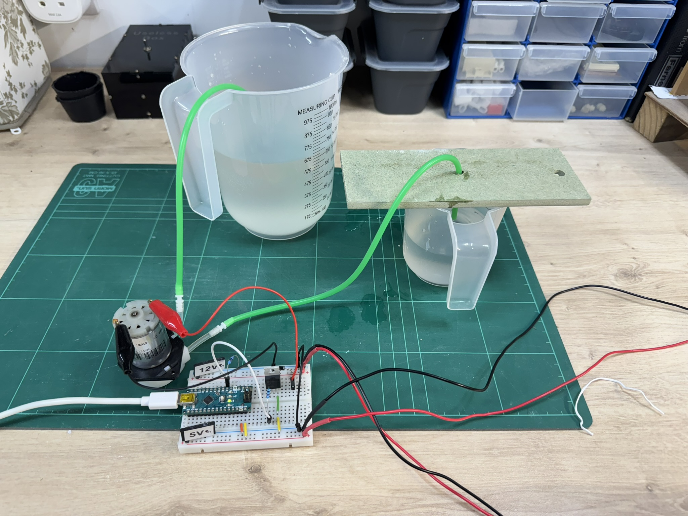
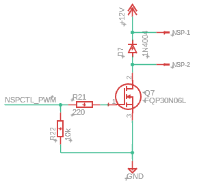
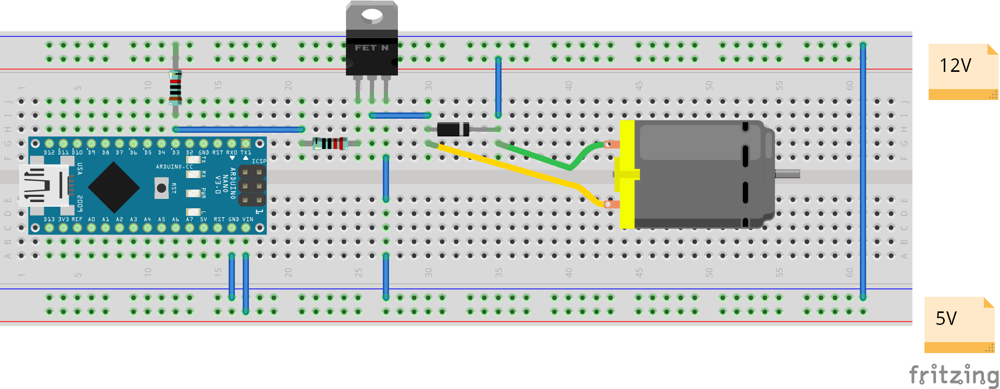

# basics-peristaltic-pump-control
Basics series - One-directional speed control of a 12V peristaltic pump.

This was tested with a simple measuring jug (so not particularly accurately) but seems to work ok. I did discover that the pump I have (Gikfun 12V peristaltic pump) doesn't actually achieve the stated 80ml / min fill rate that it claims, more like 70ml. Once calibrated, the flow rate and volume based modes worked ok. I suspect the actual PWM-dutycycle to flow rate ratio isn't linear but I haven't spent the time to evaluate that in more detail in this instance.

Test circuit diagram:

Breadboard Visualisation:

